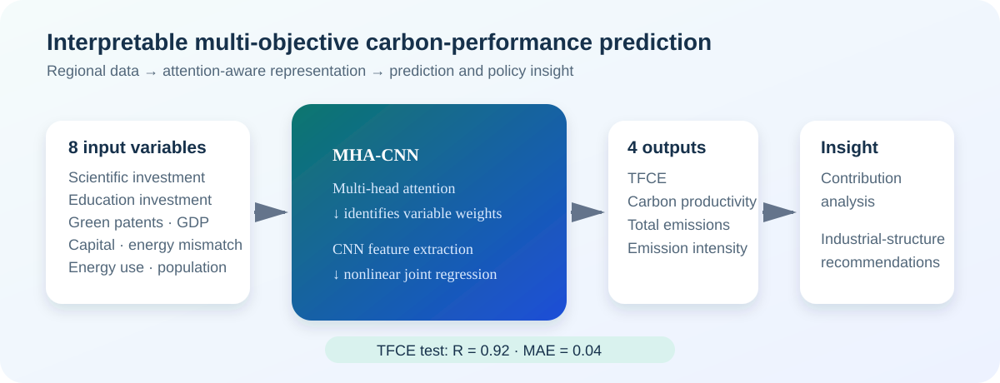

# MHA-CNN for Environmental Performance Prediction

> Multi-objective carbon-emission performance prediction and interpretable industrial-structure insights | 2022.04 - 2024.07

This portfolio documents the research outcome behind an attention-enhanced convolutional neural-network framework for regional carbon-emission performance prediction. It is a research showcase, **not** a reproduction package: source data, trained weights, and publisher PDF files are intentionally excluded.

## At a glance

| | Result |
|---|---|
| **Research focus** | Multi-objective prediction of regional carbon-emission performance indexes (CEPIs) |
| **Method** | Multi-head attention + convolutional neural network (MHA-CNN) |
| **Inputs / outputs** | 8 explanatory variables → 4 CEPIs: TFCE, carbon productivity, total carbon emissions, and carbon-emission intensity |
| **Benchmark highlight** | On TFCE testing, **R = 0.92**, **MAE = 0.04**, **MSE = 0.003** |
| **Baselines** | CNN: R = 0.43, MAE = 0.10; LSTM: R = 0.39, MAE = 0.09 |
| **Research impact** | 3 Q1 journal publications; 2 ESI Highly Cited Papers documented by 2025 evidence snapshots |

> **Metric note.** The source article reports *R* as the correlation coefficient. This repository therefore uses `R = 0.92`, rather than relabelling the result as R-squared.

## Research contribution

Carbon-emission performance is jointly driven by nonlinear, interdependent social, economic, and energy factors. Conventional CNNs can learn predictive patterns but do not explicitly quantify the relative importance of those variables.

The MHA-CNN framework integrates multi-head attention with CNN feature extraction to:

1. predict four carbon-emission performance indexes jointly from eight regional explanatory variables;
2. identify interpretable influence weights through the attention mechanism; and
3. translate the prediction and contribution analysis into industrial-structure recommendations.

  

## Evidence-backed benchmark

The article evaluates 420 provincial observations from 2006-2019 (336 training and 84 testing observations). The headline comparison below is the **TFCE testing** result reported in the paper.

| Model | R | MAE | MSE |
|---|---:|---:|---:|
| **MHA-CNN** | **0.92** | **0.04** | **0.003** |
| CNN | 0.43 | 0.10 | 0.016 |
| LSTM | 0.39 | 0.09 | 0.015 |

The attention analysis found that scientific investment, education investment, and green-patent applications were important contributors to total-factor carbon-emission efficiency. The policy interpretation is clear: increase the tertiary-industry share while reducing the first and second industry shares in regions with inefficient carbon emissions.

## Publications

Publisher PDFs are not redistributed here. Use the DOI links for the authoritative version of record.

1. **Wu, F.**, He, J., Cai, L., Du, M., & Huang, M. (2023). *Accurate multi-objective prediction of CO2 emission performance indexes and industrial structure optimization using multihead attention-based convolutional neural network.* **Journal of Environmental Management, 337**, 117759. [DOI: 10.1016/j.jenvman.2023.117759](https://doi.org/10.1016/j.jenvman.2023.117759)
2. Du, M., **Wu, F.**, Ye, D., Zhao, Y., & Liao, L. (2023). *Exploring the effects of energy quota trading policy on carbon emission efficiency: Quasi-experimental evidence from China.* **Energy Economics, 124**, 106791. [DOI: 10.1016/j.eneco.2023.106791](https://doi.org/10.1016/j.eneco.2023.106791)
3. Du, M., **Wu, F.**, Luo, L., Wang, Q., & Liao, L. (2025). *Spatial effects of the market-based energy allocation on energy efficiency: A quasi-natural experiment of energy quota trading.* **Energy, 318**, 134902. [DOI: 10.1016/j.energy.2025.134902](https://doi.org/10.1016/j.energy.2025.134902)

## Patents

| Technology | Record | Status represented in this repository |
|---|---|---|
| Carbon-emission data prediction using MHA-CNN | CN 116432822 A, application no. 202310219311.6 | **Published invention application**; the supplied portfolio contains the publication record, not a grant certificate. |
| PM2.5 prediction using Gaussian-process regression and deep learning | ZL 2023 1 0523089.9 / CN 116796805 B | **Granted invention patent** (certificate dated 2026-03-10). |

## Verification material

The repository includes only concise, presentation-appropriate evidence. See [evidence/README.md](evidence/README.md) for provenance and time context.

- [Energy Economics - ESI Highly Cited Paper, March/April 2025](evidence/energy-economics-esi-highly-cited-2025-03-04.png)
- [Energy Economics - ESI Highly Cited Paper, May/June 2025](evidence/energy-economics-esi-highly-cited-2025-05-06.png)
- [Energy - ESI Highly Cited Paper, May/June 2025](evidence/energy-esi-highly-cited-2025-05-06.png)
- [PM2.5 invention patent grant certificate](evidence/patent-pm25-grant-certificate.pdf)

## Repository scope and reuse

- The repository is intended for academic and professional portfolio review.
- Copyright in the articles remains with their respective publishers; full-text PDFs are intentionally excluded.
- Evidence images are archival snapshots, so citation counts and ESI designations should be treated as time-stamped rather than live metrics.
- No underlying data or model weights are published in this repository.

For a concise Chinese overview and a materials audit, see [docs/portfolio-evidence.md](docs/portfolio-evidence.md).
